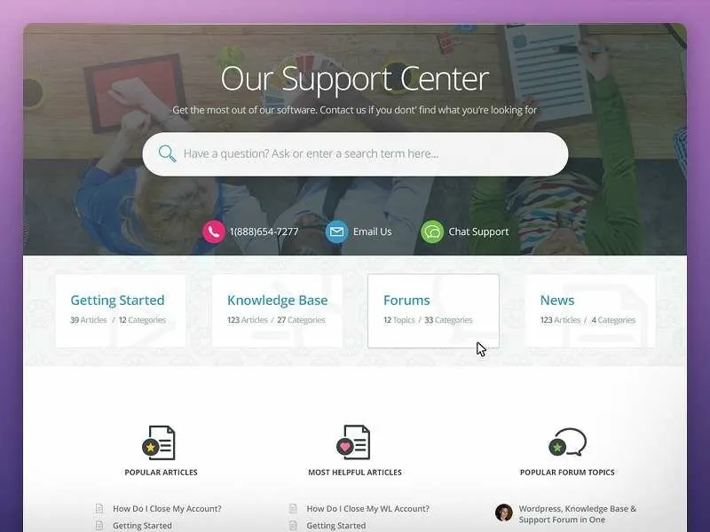
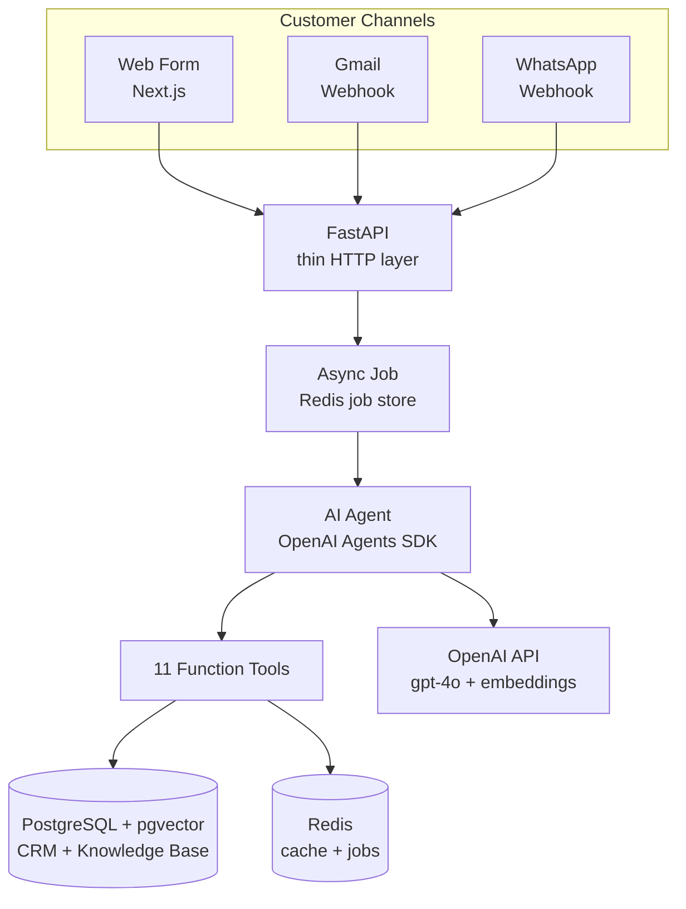
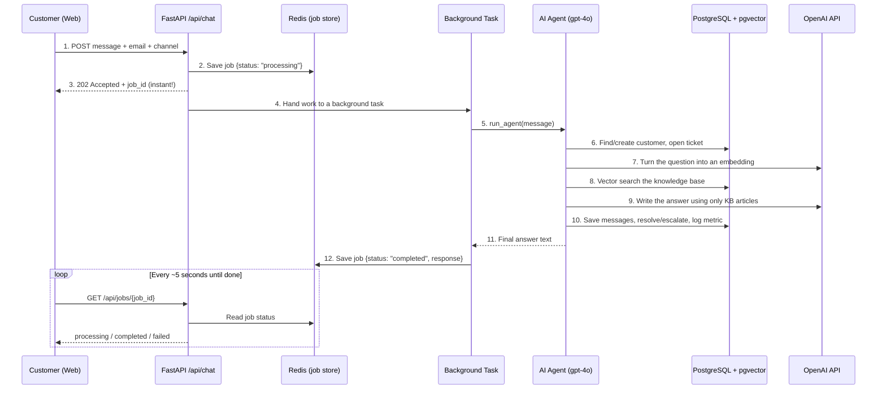

# AI Customer Support Agent — Multi-Channel Helpdesk with Semantic Search

> An open-source **AI customer support agent** that answers customer questions automatically across **Web**, **Gmail**, and **WhatsApp**. It understands a question, searches a company knowledge base by *meaning* (not just keywords), writes a helpful reply in the right tone for each channel, and hands the conversation to a human when it should. Built with the **OpenAI Agents SDK**, **FastAPI**, **PostgreSQL + pgvector**, **Redis**, and **Next.js**.

> **This README is also an interview guide.** It is written in plain English so you can read it once and confidently explain the whole project — what it does, why it was built this way, how each part works, the trade-offs, the hard problems that came up, and what would come next. Jump to the [Interview Walkthrough](#interview-walkthrough-your-spoken-script) and [Likely Interview Questions](#likely-interview-questions--strong-answers) sections when you're preparing.

If this project is useful, please consider giving it a **star** — it helps others discover it.

📖 **Full case study:** [alijawwad.com/projects/ai-support →](https://www.alijawwad.com/projects/ai-support)

<div align="center">

[](https://www.python.org/downloads/)
[](https://fastapi.tiangolo.com/)
[](https://nextjs.org/)
[](https://github.com/openai/openai-agents-python)
[](https://github.com/pgvector/pgvector)
[](https://redis.io/)
[](https://github.com/jawwad-ali/ai-customer-support-agent/actions/workflows/ci.yml)
[](#testing)
[](LICENSE)

</div>

<p align="center">
  
</p>

---

## 30-Second Pitch

> *"It's a 24/7 AI support agent that replaces the repetitive work of a first-line support rep. A customer writes in from the website, email, or WhatsApp. The AI figures out who the customer is, opens a support ticket, searches the company's help articles by meaning, and writes a reply using only the facts from those articles — so it doesn't make things up. If it can't help, or the customer is angry, or the question is about refunds or legal matters, it escalates to a human. Everything is stored in PostgreSQL, which acts as the CRM, so there's a full history. The backend is FastAPI, the AI is the OpenAI Agents SDK, semantic search runs on pgvector, Redis handles caching and background jobs, and the web form is Next.js. It has 258 automated tests and ships with Docker and Kubernetes."*

---

## Table of Contents

- [What This Project Does](#what-this-project-does)
- [The Problem It Solves](#the-problem-it-solves)
- [The Big Picture (Architecture)](#the-big-picture-architecture)
- [The Request/Response Flow (Step by Step)](#the-requestresponse-flow-step-by-step)
- [Tech Stack — and Why Each Was Chosen](#tech-stack--and-why-each-was-chosen)
- [The AI Agent and Its Tools](#the-ai-agent-and-its-tools)
- [How the Main Features Work](#how-the-main-features-work)
- [The Database (Data Model)](#the-database-data-model)
- [Key Technical Decisions & Trade-offs](#key-technical-decisions--trade-offs)
- [Challenges Faced & How They Were Solved](#challenges-faced--how-they-were-solved)
- [Future Improvements](#future-improvements)
- [Project Structure](#project-structure)
- [Getting Started](#getting-started)
- [Testing](#testing)
- [API Endpoints](#api-endpoints)
- [Deployment](#deployment)
- [Interview Walkthrough (Your Spoken Script)](#interview-walkthrough-your-spoken-script)
- [Likely Interview Questions & Strong Answers](#likely-interview-questions--strong-answers)
- [License](#license)

---

## What This Project Does

This is a full-stack **AI customer support agent**. Think of it as an AI employee that handles the first line of customer support, around the clock.

When a customer sends a message — from the **website form**, **Gmail**, or **WhatsApp** — the agent does this, in order:

1. **Identifies the customer** — finds their record by email or phone, or creates a new one.
2. **Opens a support ticket** — every conversation is tracked, categorized, and prioritized.
3. **Reads the mood (sentiment)** — gives the message a score from 0.0 (very upset) to 1.0 (very happy).
4. **Searches the knowledge base by meaning** — uses semantic search to find the most relevant help articles, even if the customer's wording is different from the article's.
5. **Writes a helpful reply** — using **only** the facts from those articles, in the right tone for the channel (formal for email, casual for WhatsApp).
6. **Escalates to a human when it should** — for refunds, legal matters, angry customers, or questions it can't answer.
7. **Records everything** — saves the conversation, updates the ticket, and logs metrics like response time and outcome.

The web channel is **fully round-tripped** — the customer types in the browser and sees the AI's reply there. Gmail and WhatsApp messages arrive through **webhooks** and are fully processed by the same agent; connecting the *outgoing* reply to the real Gmail and Twilio APIs is the main documented next step (see [Future Improvements](#future-improvements)).

> **One-line summary:** A customer asks a question → the AI finds the answer in your help docs → it replies safely and politely, or escalates → it's all logged in your database.

---

## The Problem It Solves

A growing software company gets the **same support questions over and over**: "How do I reset my password?", "Where are my invoices?", "How do I add a teammate?". Answering these manually is slow and expensive.

| The pain | What this project does about it |
|----------|----------------------------------|
| A human support rep costs **~$75,000/year** plus training and management | A "digital employee" that runs for a tiny fraction of that, **24/7, with no breaks** |
| Customers contact you on **different channels** (email, WhatsApp, web) and get treated like strangers each time | **One unified agent and one customer record** across all channels |
| Simple chatbots do **keyword matching** and miss questions worded differently | **Semantic search** understands the *meaning* of the question |
| AI chatbots often **make up answers** (hallucinate) | The agent is **forced to answer only from real help articles**, and escalates when there's no match |
| Hard questions get **stuck** with the bot | **Automatic escalation** to a human for refunds, legal issues, angry customers, or no-match questions |
| No record of what happened | **Every interaction becomes a ticket** with full conversation history and metrics |

**In one sentence:** it turns a costly, repetitive, error-prone support task into a cheap, consistent, always-on, and *honest* AI service that knows when to ask a human for help.

---

## The Big Picture (Architecture)

The system has clear layers. Each layer has one job, which keeps the code easy to reason about and test.



**How to describe each layer in an interview:**

| Layer | Folder | Its one job |
|-------|--------|-------------|
| **Channels** | `web/` | Where customers type — the Next.js web form, plus Gmail and WhatsApp webhook handlers |
| **HTTP layer** | `api/main.py` | A thin FastAPI gateway. It validates input, hands work to the agent, and returns answers. It contains *no business logic* |
| **Job layer** | `agent/cache.py` | Accepts the work instantly, runs it in the background, and stores the result in Redis so the user isn't kept waiting |
| **The Agent** | `agent/` | The brain. It follows a strict workflow and decides which tools to call, in what order |
| **Tools** | `agent/tools/` | The agent's "hands" — small, safe functions that touch the database, the knowledge base, and the cache |
| **Data + cache + AI** | PostgreSQL, Redis, OpenAI | The database (which *is* the CRM), the fast cache, and the AI models |

---

## The Request/Response Flow (Step by Step)

This is the most important section for an interview — it's the "walk me through what happens when a customer sends a message" question. By default the system is **asynchronous**: the API answers instantly with a ticket number (a `job_id`), and the frontend checks back for the result.



**In plain words:**

1. The customer submits a message. The frontend calls `POST /api/chat`.
2. The API creates a **correlation ID** (which is also the `job_id`), saves a `"processing"` record in Redis, and **immediately returns `202 Accepted`** with that `job_id`. The customer isn't left staring at a frozen page.
3. A **background task** runs the agent. The message is wrapped with context like `[Customer: jane@acme.com, Channel: web] How do I reset my password?`.
4. The agent runs its workflow (identify → ticket → sentiment → search → answer → save → resolve/escalate → log).
5. When done, the answer is stored back in Redis as `"completed"`.
6. Meanwhile, the frontend **polls** `GET /api/jobs/{job_id}` every ~5 seconds until it sees `completed` or `failed`, then shows the reply.

**Two safety fallbacks (good to mention):**

- **Synchronous mode:** call `POST /api/chat?sync=true` and the API skips the background step and returns the full answer directly (it just blocks for ~30s). Useful for testing and simple integrations.
- **Redis-down mode:** if Redis isn't available, the API notices and *automatically* falls back to synchronous mode. The product never hard-fails just because the cache is down.

---

## Tech Stack — and Why Each Was Chosen

The "why" matters more than the "what" in an interview. Here's the reasoning behind each choice.

| Technology | What it does here | **Why it was chosen** |
|-----------|-------------------|------------------------|
| **OpenAI Agents SDK** | Runs the AI agent and its tool-calling loop | It gives ready-made building blocks (`Agent`, `Runner`, `@function_tool`) so I don't have to hand-write the loop of "ask the model → it calls a tool → feed result back → repeat". It also injects shared context (DB, OpenAI client, Redis) into every tool **without exposing it to the model** |
| **GPT-4o** | The reasoning model that follows the workflow and writes replies | It's reliable at following a long, strict set of rules (the workflow + guardrails) and produces natural, on-tone answers. The model is configurable via an env var |
| **text-embedding-3-small** | Turns text into a list of 1536 numbers that capture meaning | Cheap and fast, with quality that's more than enough for searching a few hundred help articles |
| **FastAPI** | The web/API layer | Async by default (great for lots of waiting-on-AI requests), built-in input validation via Pydantic, and **built-in background tasks** — exactly what the async pattern needs, with no extra library |
| **PostgreSQL + pgvector** | Stores all data **and** does the semantic search | One database for both normal data (customers, tickets) **and** vector search. No separate vector database to run, back up, or keep in sync. It's transactional and battle-tested. *PostgreSQL **is** the CRM* |
| **asyncpg** | The PostgreSQL driver | Fast, fully async, with connection pooling. A small custom "codec" teaches it to convert Python lists to pgvector's vector type |
| **Redis** | Background-job store **and** cache | In-memory, so reads take under a millisecond. Used for two things: holding job results for the async pattern, and caching expensive lookups. It is treated as **optional** — the app degrades gracefully if it's gone |
| **Next.js 16 + React 19** | The customer-facing web form | Modern React with the App Router; the form can also be **embedded** in any website via an `/embed` page |
| **Tailwind CSS v4** | Styling | Fast, consistent, mobile-first styling without writing custom CSS files |
| **pytest + Vitest** | Testing (258 tests total) | Full coverage on both sides. All tests use **mocks** (fakeredis, fake DB and OpenAI), so they run fast and free, with no real services needed |
| **uv** | Python package manager | Much faster than pip for installs and locking |
| **Docker + Kubernetes** | Packaging and deployment | One-command local startup with Docker Compose; production-ready Kubernetes manifests with health probes and autoscaling |

---

## The AI Agent and Its Tools

The agent itself is small: a **system prompt** (its rulebook) plus a set of **tools** (functions it's allowed to call). The OpenAI Agents SDK handles the loop of letting the model decide which tool to use next.

The agent has **11 tools**. Think of them as the only actions it can take in the real world:

| Tool | What it does | Notable detail |
|------|--------------|----------------|
| `find_or_create_customer` | Finds a customer by email/phone, or creates one | Can **link** two identifiers (e.g. an email and a phone) to the same person across channels |
| `get_customer_history` | Pulls a customer's profile, past tickets, and conversations | Groups conversations by channel for a cross-channel view |
| `create_ticket` | Opens a ticket **and** its conversation together | Both rows are created in a **single transaction** so they can't get out of sync |
| `update_ticket` | Moves a ticket to a new status | Enforces **forward-only** transitions (e.g. you can't un-resolve a ticket) |
| `get_ticket` | Fetches a ticket with its full message history | Also used directly by the `/api/tickets/{id}` endpoint |
| `search_knowledge_base` | The semantic search — the heart of the project | Embeds the question, runs a cosine-similarity vector search, returns the best articles |
| `save_message` | Saves an inbound or outbound message | Clamps the sentiment score to the valid 0.0–1.0 range |
| `get_conversation_messages` | Returns a conversation's messages in order | Used for multi-turn / follow-up context |
| `send_response` | "Sends" the reply on the right channel | Truncates the reply to each channel's max length; creates a safety-net ticket if one is somehow missing |
| `escalate_to_human` | Marks a ticket as escalated with a reason | Used for refunds, legal, angry customers, or no-match questions |
| `log_metric` | Records response time, sentiment, and outcome | **Best-effort** — if logging fails, it never breaks the customer's reply |

The system prompt forces a strict order of operations and several **hard guardrails**, including:

- **Never** reply before a ticket exists.
- **Never** make up information — only use facts from knowledge-base articles.
- **Never** escalate if the search returned articles (use them instead).
- **Never** resolve a ticket while the customer is still upset (sentiment below 0.3).
- The agent's **final message is the actual answer to the customer** — not a summary of what it did.

---

## How the Main Features Work

### 1. Semantic Knowledge Base Search (the core feature)

"Semantic" means searching by **meaning**, not exact words. A customer who types *"I can't log in"* should find an article titled *"Resetting your password"*, even though they share no keywords.

How it works inside `search_knowledge_base`:

1. The question is sent to OpenAI's `text-embedding-3-small` model, which returns an **embedding** — a list of 1536 numbers that represents the meaning of the text.
2. That embedding is compared against the embeddings of all help articles using **cosine similarity** (pgvector's `<=>` operator), which measures how close two meanings are.
3. Only articles above a **similarity threshold (0.25)** are kept, and the **top 3** are returned.
4. If nothing clears the bar, the tool returns "no match" and the agent escalates to a human instead of guessing.

A real bug-fix lives here: pgvector's IVFFlat index defaults to scanning only **one** "list" of vectors, which made it miss most articles. The fix is `SET LOCAL ivfflat.probes = 10` before each search, so it scans more lists and actually finds the right articles. (See [Challenges](#challenges-faced--how-they-were-solved).)

### 2. Async Background Processing (so the user never waits)

AI replies can take many seconds. Instead of holding the connection open:

- `POST /api/chat` returns **`202 Accepted` + a `job_id` instantly**.
- The work runs in a **FastAPI background task**.
- The result is stored in Redis, and the frontend **polls** for it.
- A job stuck in `"processing"` for more than **5 minutes** is automatically treated as **failed** when read, so nothing hangs forever.

### 3. Caching (to save money and time)

Calling OpenAI and the database for the *same* thing repeatedly is wasteful, so common results are cached in Redis using the **cache-aside** pattern (check cache first, fall back to the source, then store the result):

| What's cached | How long | Why |
|---------------|----------|-----|
| Knowledge-base search results | 1 hour | Avoids paying for an embedding + vector query for repeat questions |
| Channel settings (tone, max length) | 24 hours | This config rarely changes |
| Customer lookups (email/phone → ID) | 1 hour | Avoids a database hit on every message |
| Background job results | 1 hour | Powers the async polling pattern |

All keys are namespaced under `crm:`, and **every cache function safely does nothing if Redis is missing**. One deliberate rule: **agent replies are never cached**, because customer data changes constantly and a stale answer could be wrong or harmful.

### 4. Smart Escalation (knowing when to ask a human)

The agent escalates — instead of answering — when any of these are true:

- The request is about **refunds, billing disputes, legal matters, or account deletion**.
- The customer's **sentiment is below 0.3** (they're clearly upset).
- The knowledge base returned **zero matching articles**.
- A tool fails in a way it can't recover from.

This is the feature that keeps the AI **honest and safe**: it would rather hand off to a person than invent an answer.

### 5. Cross-Channel Identity (one customer, many channels)

A person might use the web form today and WhatsApp tomorrow. The database separates a **customer** from their **identifiers** (emails and phone numbers). When someone appears on a new channel, the agent can ask for a known identifier and **link** the new one to the existing customer — so their history stays in one place.

### 6. Channel-Aware Tone

A `channel_configs` table stores the personality and length limit per channel:

| Channel | Tone | Max length |
|---------|------|------------|
| Web | Semi-formal | 1,500 chars |
| Gmail | Formal, thorough | 2,500 chars |
| WhatsApp | Conversational, short | 800 chars |

`send_response` reads this config and **truncates** replies that are too long for the channel.

### 7. Traceability with Correlation IDs

Every request gets a **correlation ID** (using Python `contextvars`, which safely carries the value across async code). It's attached to every log line, and it's reused as the `job_id`. So one ID lets you follow a single customer request through the API, the background task, and every tool call — across structured JSON logs.

---

## The Database (Data Model)

PostgreSQL holds everything. This is the "CRM" — there's no Salesforce or HubSpot involved.

| Table | What it stores |
|-------|----------------|
| `customers` | One row per person |
| `customer_identifiers` | Their emails and phone numbers (this is what enables cross-channel linking) |
| `tickets` | One per support request, with status, category, priority, and an optional `parent_ticket_id` for follow-ups |
| `conversations` | One per ticket (1:1), tying messages to a ticket |
| `messages` | Each inbound/outbound message, with a sentiment score |
| `knowledge_base` | Help articles, each with a 1536-number `embedding` for semantic search |
| `channel_configs` | Tone and length rules per channel |
| `agent_metrics` | Response time, sentiment, and outcome of each interaction |

Two design details worth mentioning:

- **Ticket status is forward-only** (`open → in_progress → resolved`, and any state can go to `escalated`). You never reopen a ticket — follow-ups create a new ticket that points back to the old one. This keeps the history clean and auditable.
- The `knowledge_base` table uses an **IVFFlat vector index** for fast similarity search.

---

## Key Technical Decisions & Trade-offs

Interviewers love this section because it shows you made *choices*, not just followed a tutorial.

| Decision | Why | The trade-off I accepted |
|----------|-----|--------------------------|
| **PostgreSQL + pgvector** instead of a dedicated vector database (Pinecone, Weaviate) | One database to run, back up, and keep consistent; it's transactional and I already need PostgreSQL for the CRM | A specialized vector DB scales better at millions of vectors. For a few hundred help articles, that's overkill — and I documented HNSW as a future upgrade |
| **FastAPI background tasks + Redis polling** instead of Celery or Kafka | Far simpler — no extra broker or worker process to run, yet it still frees the user from waiting | Background tasks run inside the API process, so they'd be lost if the pod restarts mid-job. I accepted this for the current scale and documented the Kafka migration path |
| **`202` + polling** instead of WebSockets or Server-Sent Events | Dead-simple, stateless, works through any proxy or load balancer, and is trivial to test | Polling is slightly chattier than a live connection. Acceptable for support, where replies take seconds, not milliseconds |
| **The LLM estimates sentiment** instead of a separate sentiment model | One model call does everything; no extra service to deploy | A dedicated sentiment model would be more precise. For *routing* (is this person upset?), "good enough" is genuinely good enough |
| **Redis is optional** with graceful fallback | The product should never go down just because the cache is down | When Redis is gone, you lose async mode and caching (slower, more expensive). Resilience beat raw speed here |
| **Strict prompt + guardrails** to block hallucination | A support bot that invents answers is worse than no bot | The agent sometimes escalates a question it *might* have answered. I chose "safe and honest" over "confident and wrong" |
| **All tests use mocks** (no real DB/Redis/OpenAI) | Fast, free, deterministic tests that run anywhere, including CI | Mocks don't catch real integration issues. A small set of integration tests is a sensible next step |

---

## Challenges Faced & How They Were Solved

These are the real "war stories" — great for the "tell me about a hard problem" question.

1. **Semantic search was missing obvious matches.**
   pgvector's IVFFlat index defaults to scanning only one cluster of vectors (`probes = 1`), so most articles were never even considered. *Solution:* run `SET LOCAL ivfflat.probes = 10` before each search so it scans more clusters and reliably finds the right article.

2. **The AI replied with a summary instead of the actual answer.**
   The model would sometimes respond "I've created a ticket and looked into your issue" rather than the real help. *Solution:* a dedicated, emphatic section of the system prompt that makes clear its **final message is shown directly to the customer** and must be the real answer.

3. **The AI tried to make up answers.**
   *Solution:* hard guardrails — only answer from knowledge-base articles, a similarity threshold to filter weak matches, and a rule to escalate when there's no match.

4. **Replies were too long for WhatsApp.**
   A formal, multi-paragraph email reply is wrong for a chat app. *Solution:* per-channel config with a max length, and automatic truncation in `send_response`.

5. **Background jobs could hang forever.**
   *Solution:* jobs stuck "processing" for over 5 minutes are automatically reported as failed when read, and the frontend has its own 5-minute timeout plus network-retry logic.

6. **Redis was a single point of failure.**
   *Solution:* every Redis call is written to safely no-op when the client is missing, and the API automatically falls back to synchronous mode if Redis is down.

7. **Tracing a single request across async background work was hard.**
   *Solution:* a correlation ID carried with `contextvars`, attached to every JSON log line and reused as the job ID.

8. **The same person on two channels looked like two customers.**
   *Solution:* separate `customers` and `customer_identifiers` tables, with a cross-channel linking step in `find_or_create_customer`.

9. **Getting Python lists in and out of pgvector's `vector` type.**
   *Solution:* a custom asyncpg type codec in `database/pool.py` that converts between Python `list[float]` and pgvector's text format on every connection.

---

## Future Improvements

A clear roadmap shows you know what "production at scale" really means. The scaling plan is documented in [`docs/scaling-notes.md`](docs/scaling-notes.md).

- **Real outbound delivery for Gmail & WhatsApp** — inbound messages are already processed by the agent; the next step is sending the reply back out via the Gmail API and Twilio (currently only the web channel is fully round-tripped).
- **Kafka for heavy write workloads** — move agent processing onto a durable message queue so jobs survive restarts and the system handles huge bursts (env placeholders are already in place).
- **Read replicas + PgBouncer** — for serving lots of users their *own* data (history, ticket lists), where caching doesn't help. PgBouncer pools connections so PostgreSQL's connection limit isn't exhausted.
- **HNSW vector index** — swap IVFFlat for HNSW as the knowledge base grows, for faster and more accurate search at scale.
- **Streaming replies** — stream the answer to the web UI token-by-token instead of polling for the final result.
- **Daily sentiment reports** — automated summaries of customer mood and common issues.
- **Auth, rate limiting, and multi-tenancy** — so multiple companies can use one deployment safely.
- **A feedback loop** — learn from resolved tickets to improve future answers.

---

## Project Structure

```
ai-customer-support-agent/
├── agent/                          # The AI agent (the "brain")
│   ├── customer_success_agent.py   #   Agent definition + run_agent()
│   ├── prompts.py                  #   The system prompt (rulebook + guardrails)
│   ├── context.py                  #   Shared context: DB pool + OpenAI client + Redis
│   ├── cache.py                    #   Redis caching + background job store
│   ├── __init__.py                 #   Correlation IDs + structured JSON logging
│   └── tools/                      #   The agent's 11 "hands"
│       ├── customer.py             #     find/create/link customers
│       ├── ticket.py               #     create/update/get tickets
│       ├── conversation.py         #     save/get messages
│       ├── knowledge.py            #     semantic knowledge-base search
│       ├── response.py             #     channel-aware replies
│       ├── escalation.py           #     hand off to a human
│       └── metrics.py              #     log outcomes
├── api/
│   └── main.py                     # FastAPI endpoints + background tasks (thin layer)
├── web/                            # Next.js 16 frontend
│   └── src/
│       ├── app/                    #   Pages (incl. /embed embeddable widget)
│       ├── components/             #   React components (form, chat thread, status)
│       ├── hooks/                  #   Polling, cooldown, health-check, conversation
│       └── lib/                    #   API client + shared types
├── database/
│   ├── pool.py                     # asyncpg pool + pgvector codec
│   └── migrations/                 # Schema + knowledge-base seed data
├── k8s/                            # Kubernetes manifests (deployments, services, HPA, probes)
├── tests/                          # 177 backend tests (pytest)
├── docs/
│   ├── hackathon-spec.md           # Original full specification
│   └── scaling-notes.md            # Production scaling guide
├── docker-compose.yml              # One-command local environment
└── Dockerfile                      # Multi-stage build for the API
```

---

## Getting Started

### Quick Start with Docker (easiest)

```bash
git clone https://github.com/jawwad-ali/ai-customer-support-agent.git
cd ai-customer-support-agent
cp .env.example .env   # add your OPENAI_API_KEY
docker compose up
```

Backend → `http://localhost:8000` | Frontend → `http://localhost:3000`

### Prerequisites (Manual Setup)

- Python 3.12+
- Node.js 20+
- PostgreSQL 16+ with the [pgvector extension](https://github.com/pgvector/pgvector)
- Redis 7+
- [uv](https://docs.astral.sh/uv/) (Python package manager)

### Installation

```bash
# Clone
git clone https://github.com/jawwad-ali/ai-customer-support-agent.git
cd ai-customer-support-agent

# Python environment
uv venv
source .venv/bin/activate        # Linux/Mac
# .venv\Scripts\activate         # Windows
uv pip install -e ".[dev]"

# Frontend
cd web && npm install && cd ..

# Configure
cp .env.example .env
# Edit .env: DATABASE_URL, OPENAI_API_KEY, REDIS_URL

# Initialize the database
psql $DATABASE_URL < database/migrations/001_initial_schema.sql
python -m database.migrations.002_seed_knowledge_base

# Start Redis
redis-server                     # Linux/Mac
# wsl sudo service redis-server start  # Windows

# Start the backend
uvicorn api.main:app --reload

# Start the frontend (new terminal)
cd web && npm run dev
```

Open `http://localhost:3000` — the support form is ready.

---

## Testing

**258 automated tests** — 177 backend (pytest) + 81 frontend (Vitest + React Testing Library).

```bash
# Backend (177 tests)
pytest tests/ -v

# Frontend (81 tests)
cd web && npm test

# Backend with coverage
pytest tests/ --cov=agent --cov=api
```

The testing philosophy is **mock everything external** so tests are fast, free, and deterministic:

- **Backend:** `fakeredis` for Redis, and `AsyncMock` for the database pool and the OpenAI client — no real services or API keys needed.
- **Frontend:** a mocked `fetch`, plus `vitest-axe` to automatically check accessibility.

---

## API Endpoints

| Method | Endpoint | Description |
|--------|----------|-------------|
| `POST` | `/api/chat` | Submit a support message (`202` async by default, `200` with `?sync=true`) |
| `GET`  | `/api/jobs/{job_id}` | Poll for an async job's result |
| `POST` | `/api/webhooks/gmail` | Inbound Gmail message |
| `POST` | `/api/webhooks/whatsapp` | Inbound WhatsApp message |
| `GET`  | `/api/tickets/{id}` | Get ticket details |
| `GET`  | `/api/customers/{id}/history` | Get a customer's full history |
| `GET`  | `/health` | Basic health check |
| `GET`  | `/health/live` | Liveness probe (is the process alive?) |
| `GET`  | `/health/ready` | Readiness probe (are the database and Redis connected?) |

---

## Deployment

### Docker

```bash
docker compose up       # API + Frontend + PostgreSQL + Redis, all at once
```

### Kubernetes

Production-ready manifests live in [`k8s/`](k8s/):

- Namespace, ConfigMap, and Secret manifests (secrets are empty placeholders — you create the real ones at deploy time).
- Deployments and Services for the API, web frontend, PostgreSQL, and Redis.
- A Horizontal Pod Autoscaler (HPA) for the API.
- Health probes wired to `/health/live` (liveness) and `/health/ready` (readiness).

See [`docs/scaling-notes.md`](docs/scaling-notes.md) for production scaling guidance.

---

## Interview Walkthrough (Your Spoken Script)

When an interviewer says *"walk me through this project,"* here's a 2–3 minute narrative you can deliver:

> "This is an AI customer support agent — basically a 24/7 digital support employee. The problem it solves is that growing companies get the same questions over and over across email, WhatsApp, and their website, and answering them manually is slow and expensive, while basic chatbots either miss the question or make up answers.
>
> So I built an agent using the OpenAI Agents SDK. When a message comes in through any of the three channels, FastAPI receives it. FastAPI is intentionally a *thin* layer — it just validates the input and hands the work to the agent. Because AI replies take a few seconds, I return a job ID instantly and run the work in the background, storing the result in Redis. The frontend polls for the result, so the user never waits on a frozen screen. If Redis is down, it automatically falls back to answering directly — the product never hard-fails on a cache outage.
>
> The agent follows a strict workflow: identify the customer, open a ticket, score the sentiment, then search the knowledge base. The key feature is that the search is *semantic* — I turn the question into an embedding and use pgvector inside PostgreSQL to find the closest help articles by meaning. The big rule is that the agent can only answer using facts from those articles. If there's no good match, or the customer's angry, or it's about refunds or legal stuff, it escalates to a human instead of guessing. That's what keeps it honest.
>
> Everything lives in PostgreSQL, which acts as the CRM — customers, tickets, conversations, messages, and the help articles, all in one place. I chose pgvector over a dedicated vector database so there's just one system to run, since the article count is small. I deliberately kept the async layer simple — FastAPI background tasks plus Redis polling instead of Kafka — and I documented the path to Kafka and read replicas for when it needs to scale.
>
> It's got 258 tests across the backend and frontend, all mocked so they run fast, and it ships with Docker and Kubernetes including health probes and autoscaling."

Then pause and let them ask about whichever part interests them — every claim above is backed by a section in this README.

---

## Likely Interview Questions & Strong Answers

**Q: What is "semantic search" and why not just use keywords?**
A: Keyword search only matches exact words, so "I can't log in" wouldn't find an article called "Reset your password." Semantic search converts text into embeddings — lists of numbers that capture meaning — and finds the closest matches by *meaning*. I use OpenAI's `text-embedding-3-small` and pgvector's cosine similarity.

**Q: How do you stop the AI from hallucinating (making things up)?**
A: Three layers. First, the system prompt forbids answering from anything but knowledge-base articles. Second, the search applies a similarity threshold, so weak matches are dropped. Third, if there are zero good matches, the agent is required to escalate to a human rather than guess.

**Q: Why is the API asynchronous? Walk me through it.**
A: AI replies take several seconds, and I don't want to hold the HTTP connection open. So `POST /api/chat` returns `202 Accepted` with a job ID immediately, the agent runs in a background task, the result goes into Redis, and the frontend polls `GET /api/jobs/{id}` until it's done. There's also a sync mode for testing, and it auto-falls back to sync if Redis is unavailable.

**Q: Why PostgreSQL with pgvector instead of a vector database like Pinecone?**
A: I already needed PostgreSQL for the CRM data, and pgvector lets me do vector search in that same database — one system to run, back up, and keep consistent, plus full transactions. A dedicated vector DB wins at massive scale, but for a few hundred help articles it's unnecessary complexity. I noted HNSW indexing as the upgrade path if the knowledge base grows.

**Q: What happens if Redis goes down?**
A: Nothing fatal. Every cache and job function is written to safely do nothing when the Redis client is missing, and the API automatically switches to synchronous mode. You lose the async behavior and caching — so it's slower and a bit more expensive — but the product keeps serving customers.

**Q: How does it handle the same customer on different channels?**
A: I separate the `customers` table from a `customer_identifiers` table that holds their emails and phone numbers. When someone shows up on a new channel, the agent can link the new identifier to the existing customer, so all their history stays in one record.

**Q: What was the hardest bug?**
A: Semantic search was silently missing obvious matches. The cause was pgvector's IVFFlat index defaulting to scanning just one cluster of vectors, so most articles were never considered. The fix was setting `ivfflat.probes = 10` per query so it scans more clusters. It taught me that vector indexes trade accuracy for speed, and you have to tune that explicitly.

**Q: How do you know it works? How is it tested?**
A: 258 automated tests — 177 backend, 81 frontend. They mock all external services (Redis, the database, OpenAI), so they're fast, free, and deterministic, and they run in CI on every push. The frontend tests even include automated accessibility checks.

**Q: What would you do next / what's missing?**
A: The biggest gap is wiring the *outbound* Gmail and WhatsApp delivery to the real Gmail and Twilio APIs — inbound messages are already fully processed, but only the web channel currently round-trips the reply. After that: Kafka for durable background processing at scale, read replicas plus PgBouncer for serving per-user data, and streaming replies in the UI.

---

## Contributing

Contributions are welcome — see [CONTRIBUTING.md](CONTRIBUTING.md) for setup, code style, and the PR process.

---

If this project helped you, please consider giving it a **star** — it helps others discover it too.

## License

Licensed under the MIT License — see [LICENSE](LICENSE) for details.
